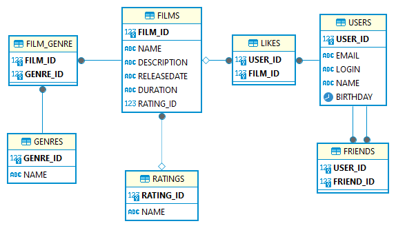

# java-filmorate



>[SQL код базы данных](src/main/resources/shema.sql)
***
## Примеры запросов SQL:

### Добавить нового пользователя:
```roomsql
INSERT INTO users (email, login, name, birthday)
VALUES (?, ?, ?, ?);
```
### Обновить данные пользователя:
```roomsql
UPDATE users 
SET email = ?, login = ?, name = ?, birthday = ? 
WHERE user_id = ?;
```
### Удалить пользователя:
```roomsql
DELETE FROM users
WHERE user_id = ?; 
```
### Найти пользователя:
```roomsql
SELECT * FROM users WHERE users_id = ?;
```
### Добавить друга пользователю:
```roomsql
INSERT INTO friends (user_id, friend_user_id)
VALUES (?, ?);
```
### Удалить друга у пользователя:
```roomsql
DELETE FROM friends
WHERE 
    user_id = ?
AND 
    friend_user_id = ?;
```
### Показать список друзей пользователя:
```roomsql
SELECT u.email, u.login, u.name, u.birthday
FROM 
    users AS u
JOIN
    friends AS f ON f.friend_id = u.user_id
WHERE f.user_id = ?;
```
### Показать список общих друзей пользователей:
```roomsql
SELECT name, login, email, birthday FROM users
WHERE
    user_id IN (
        SELECT friends_user_id FROM friends WHERE user_id = ?
    ) AND user_id IN (
        SELECT friends_user_id FROM friends WHERE user_id = ?
    );
```
***
### Добавить фильм
```roomsql
INSERT INTO films (name, description, releaseDate, duration, rating)
VALUES (?, ?, ?, ?, ?);
```
### Обновить данные фильма:
```roomsql
UPDATE films
SET name = ?, description = ?, releaseDate = ?, duration = ?, rating = ?
WHERE film_id = ?;
```
### Удалить фильм из базы данных:
```roomsql
DELETE FROM films
WHERE film_id = ?;
```
### Найти фильм:
```roomsql
SELECT name, description, releaseDate, duration, rating 
FROM films
WHERE film_id = ?;
``` 
### Добавить лайк фильму от пользователя:
```roomsql
INSERT INTO likes (film_id, user_id)
VALUES (?, ?);
```
### Удалить лайк у фильма от пользователя
```roomsql
DELETE FROM likes
WHERE
    film_id = ?
AND 
    user_id = ?;
```
### Показать N самых популярных фильмов
```roomsql
SELECT name, description, releaseDate, duration, rating
FROM films
WHERE film_id IN (
    SELECT film_id
    FROM likes
    GROUP BY film_id
    ORDER BY COUNT(user_id) DESC
    LIMIT ?
);
```